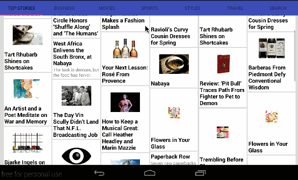

# NYTimesSearch
# Project 2 - NYTimesSearch

**Name of your app** is an android app that allows a user to search for articles on web using simple filters. The app utilizes [New York Times Search API](http://developer.nytimes.com/docs/read/article_search_api_v2).

Time spent: 15-20 hours spent in total

## User Stories

The following **required** functionality is completed:

* [x] User can **search for news article** by specifying a query and launching a search. Search displays a grid of image results from the New York Times Search API.
  * [x] Used the **ActionBar SearchView** or custom layout as the query box
* [x] User can click on "settings" which allows selection of **advanced search options** to filter results
* [x] User can configure advanced search filters such as:
  * [x] Begin Date (using a date picker)
  * [x] News desk values (Arts, Fashion & Style, Sports)
  * [x] Sort order (oldest or newest)
* [x] Subsequent searches have any filters applied to the search results
* [x] User can tap on any image in results to see the full text of article **full-screen**
* [x] User can **scroll down to see more articles**. The maximum number of articles is limited by the API search.
* [x] User can **share an article link** to their friends or email it to themselves

The following **optional** features are implemented:

* [x] Improved the user interface and experiment with image assets and/or styling and coloring
* [x] Replaced Filter Settings Activity with a lightweight modal overlay
* [x] Implements robust error handling, [check if internet is available](http://guides.codepath.com/android/Sending-and-Managing-Network-Requests#checking-for-network-connectivity), handle error cases, network failures
* [x] Use the [RecyclerView](http://guides.codepath.com/android/Using-the-RecyclerView) with the `StaggeredGridLayoutManager` to display improve the grid of image results
* [x] For different news articles that only have text or only have images, use [Heterogenous Layouts](http://guides.codepath.com/android/Heterogenous-Layouts-inside-RecyclerView) with RecyclerView
* [x] Apply the popular [Butterknife annotation library](http://guides.codepath.com/android/Reducing-View-Boilerplate-with-Butterknife) to reduce view boilerplate.
* [x] Use Parcelable instead of Serializable using the popular [Parceler library](http://guides.codepath.com/android/Using-Parceler).
* [x] Replace Picasso with [Glide](http://inthecheesefactory.com/blog/get-to-know-glide-recommended-by-google/en) for more efficient image rendering.
* [x] Leverage the popular [GSON library](http://guides.codepath.com/android/Using-Android-Async-Http-Client#decoding-with-gson-library) to streamline the parsing of JSON data.
* [x] Leverage the popular [Retrofit networking library](http://guides.codepath.com/android/Consuming-APIs-with-Retrofit) to access the New York Times API.

The following **additional** features are implemented:

* [x] Added tabs for quick access to latest articles from popular news desks.  Source:  http://www.android4devs.com/2015/01/how-to-make-material-design-sliding-tabs.html
* [x] Added additional rows in grid for landscape layout to take advantage of additional space.
* [x] Show search history when entering query using SimpleCursorAdapter.
* [x] Show progress bar when waiting for response from REST API.
* [x] Use Ice Pick for retaining state after device rotation.

## Video Walkthrough

Here's a walkthrough of implemented user stories:

GIF created with [LiceCap](http://www.cockos.com/licecap/).

## Notes

Describe any challenges encountered while building the app.

## Open-source libraries used

- [Retrofit](http://square.github.io/retrofit/) - Simple asynchronous HTTP requests with JSON parsing
- [Glide](https://github.com/bumptech/glide) - Image loading and caching library for Android
- [Ice Pick](https://github.com/frankiesardo/icepick) - Icepick is an Android library that eliminates the boilerplate of saving and restoring instance state. 
- [Parceler](https://github.com/johncarl81/parceler) - Parceler is a code generation library that generates the Android Parcelable boilerplate source code.

## License

    Copyright 2016 Jamie Ho

    Licensed under the Apache License, Version 2.0 (the "License");
    you may not use this file except in compliance with the License.
    You may obtain a copy of the License at

        http://www.apache.org/licenses/LICENSE-2.0

    Unless required by applicable law or agreed to in writing, software
    distributed under the License is distributed on an "AS IS" BASIS,
    WITHOUT WARRANTIES OR CONDITIONS OF ANY KIND, either express or implied.
    See the License for the specific language governing permissions and
    limitations under the License.
